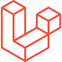

<h1 align="center">Hi, I'm Sachin Sharma 👋</h1>

  

  💼 Senior PHP Developer | Backend Specialist | Laravel Architect  

  <a href="mailto:sachinphp@outlook.com">📧 sachinphp@outlook.com</a> &nbsp;|&nbsp;
  <a href="https://stackoverflow.com/users/22535780/php-fact">🧠 Stack Overflow</a> &nbsp;|&nbsp;
  <a href="https://x.com/phpfact">🐦 Twitter</a>

---

## 🚀 About Me

I'm a **Senior PHP Developer** with over **12 years of hands-on experience** building reliable, scalable, and high-performance web applications. I specialize in **Laravel**, **CodeIgniter**, **Yii**, and **Laravel Filament**, and I’m passionate about clean architecture, modular codebases, and developer productivity.

I thrive in fast-paced environments where backend stability meets frontend performance. My work spans across startups, agencies, and product-based companies, contributing to both client-facing platforms and internal admin systems.

---

## 🧠 Core Expertise

- ⚙️ **PHP / Laravel / Laravel Filament / CodeIgniter / Yii2**
- 🧱 **Modular Architecture**, **RESTful APIs**, **Custom Admin Panels**
- 🐳 **Docker**, **Git**, **Linux Server Management**
- ☁️ **AWS/DigitalOcean**, **VPS Deployment**, **CI/CD Integration**
- 🧩 **WordPress Development** for plugin customization and headless architecture
- 🔌 **WebSockets**, **Socket.IO**, and **Real-time App Integration**
- 🛠️ **MySQL & MongoDB**: Schema Design, Optimization, and Indexing
- 📦 **API Integrations**: Payment Gateways, SMS/Email Providers, OAuth2
- 🧪 **Testing**: PHPUnit, PestPHP, Postman, TDD, feature tests in Laravel.
- 📈 **Performance**: Fast APIs with query optimization, Redis/Memcached, Laravel Horizon, load balancing, indexing.
- 🧰 **Task Scheduling**: Laravel Scheduler, Queues, Horizon, Supervisor for background tasks.
- 🛡️ **Security**: OWASP, Sanctum, Passport, 2FA, API rate limits, CSRF/XSS protection.
- 🏗️ **Microservices**: Build microservices and API Gateways using Docker.
- 🌐 **Frontend Basics**: Vue.js, Alpine.js, React for admin or small UI parts.
- 📊 **Dashboards**: Filament Widgets, Chart.js, ApexCharts for reports and analytics.
- 🧹 **Clean Code**: Pint, PHP CS Fixer, Larastan, pre-commit hooks for code quality.
- 📄 **Documentation**: OpenAPI/Swagger docs, API Resources, project documentation.

---

## 🏆 Career Highlights

- ✅ Migrated large-scale CodeIgniter 3 systems to Laravel with zero downtime  
- 🔄 Automated deployments and testing via Docker & GitHub Actions  
- 📊 Built highly customizable dashboards using **Laravel Filament**  
- 🛡️ Integrated secure authentication layers including 2FA and token-based APIs  
- 🔄 Connected backend services to mobile apps via robust, scalable APIs  
- 🔧 Developed reusable Laravel packages for internal toolkits  
- 📈 Led architecture planning for eCommerce and legal-tech platforms

---

## 🛠️ Technologies I Work With

## 🛠️ Technical Expertise

**Frontend**

 &nbsp;
 &nbsp;
 &nbsp;
 &nbsp;
 &nbsp;

**Backend**

 &nbsp;
 &nbsp;
 &nbsp;
 &nbsp;
 &nbsp;

**Databases**

 &nbsp;
 &nbsp;
 &nbsp;

**Infrastructure & DevOps**

 &nbsp;
 &nbsp;
 &nbsp;
 &nbsp;
 &nbsp;

 
---

<!--
 ## 📈 GitHub Analytics

  
  

  

-->

---

## 🌐 Let's Connect

  
  
  
  
    
  

###

<!--
    
-->

###

---

> ✅ *I’m always open to collaborating on meaningful Laravel, Filament, or backend-focused projects. Let’s build something impactful.*
